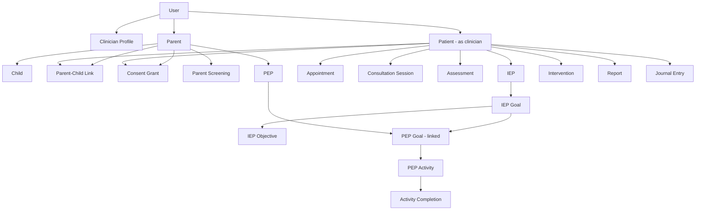
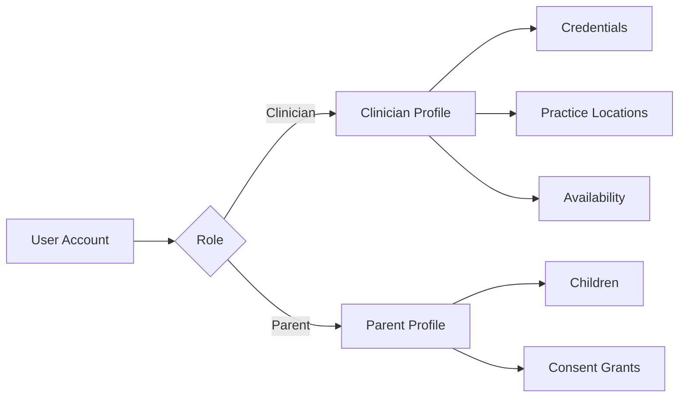
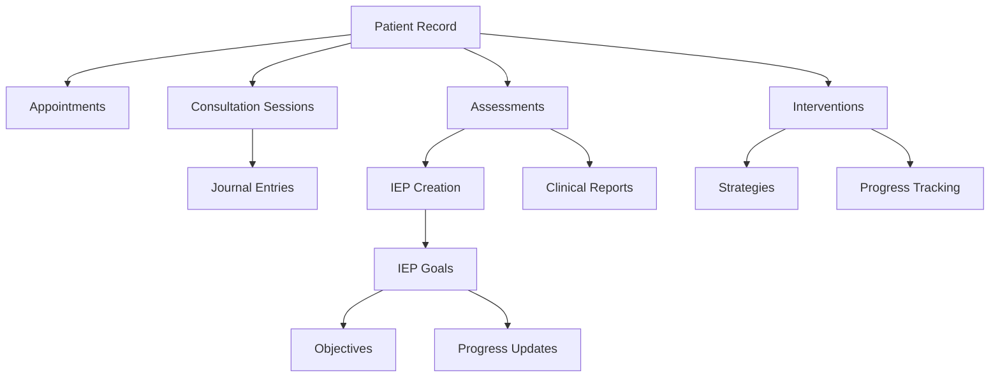
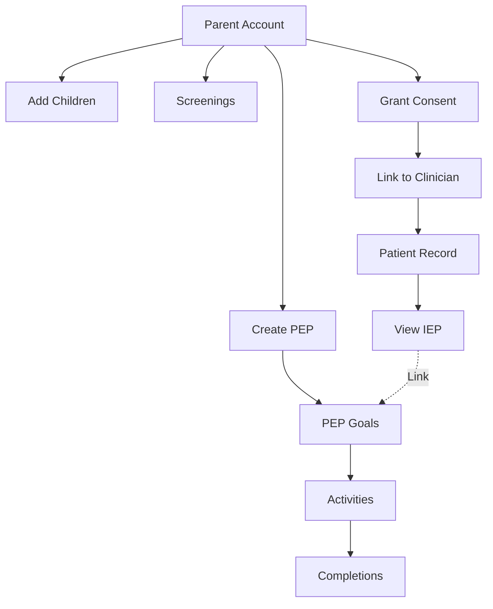
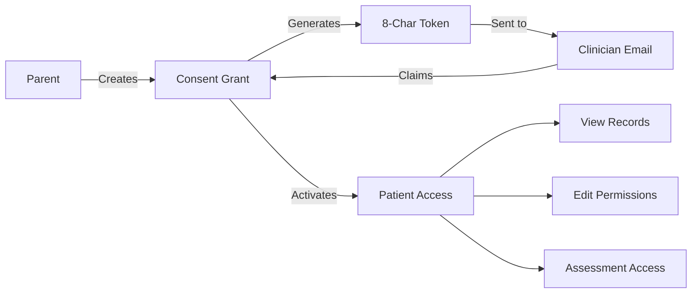

# Complete Database Schema Documentation - Daira Clinical Platform

> [!IMPORTANT]
> **Comprehensive Database Schema Analysis for Parent Portal**
> 
> This document contains the complete database schema analysis including all tables, relationships, field definitions, indexes, constraints, and introspection queries. Use this as your single source of truth for database structure.

**Database Type**: SQLite  
**ORM**: Prisma Client  
**Total Tables**: 50+  
**Schema File**: [prisma/schema.prisma](file:///Users/anikaet/Downloads/Jiveesha-Clinical/backend/prisma/schema.prisma)  
**Generated**: 2026-01-04

---

## Table of Contents

1. [Database Overview](#database-overview)
2. [Complete Table Inventory](#complete-table-inventory)
3. [Primary Keys & Constraints](#primary-keys--constraints)
4. [Foreign Key Relationships](#foreign-key-relationships)
5. [Critical Identifiers](#critical-identifiers)
6. [Indexes](#indexes)
7. [Relationship Diagrams](#relationship-diagrams)
8. [Detailed Field Reference](#detailed-field-reference)
9. [Introspection Queries](#introspection-queries)

---

## Database Overview

- **Database Type**: SQLite
- **ORM**: Prisma Client
- **Total Tables**: 50+
- **Database File**: `prisma/dev.db`
- **Schema File**: `prisma/schema.prisma`

### Architecture Phases

The database is organized into 10 major functional phases:

1. **Phase 0**: Authentication & Users (6 tables)
2. **Phase 1**: Settings & Locations (3 tables)
3. **Phase 2**: Patient Management (5 tables)
4. **Phase 3**: Scheduling (4 tables)
5. **Phase 4**: Consultation Sessions (4 tables)
6. **Phase 5**: Patient Journal & Notifications (4 tables)
7. **Phase 6**: Assessments (2 tables)
8. **Phase 7**: IEP System (9 tables)
9. **Phase 8**: Interventions & Reports (4 tables)
10. **Phase 9**: Messaging (2 tables)
11. **Phase 10**: Parent Portal (3 tables)
12. **Phase 11**: Consent Management (1 table)
13. **Phase 12**: Parent Screening (4 tables)
14. **Phase 13**: PEP System (5 tables)
15. **Phase 14**: Resource Library (1 table)

---

## Complete Table Inventory

### PHASE 0: Authentication & Users

| # | Table | Purpose | Primary Key | Records Type |
|---|-------|---------|-------------|--------------|
| 1 | `users` | Core user authentication | `id` (UUID) | Clinicians & Parents |
| 2 | `clinician_profiles` | Clinician professional details | `id` (UUID) | Profile data |
| 3 | `credentials` | Professional credentials | `id` (UUID) | Licenses & certifications |
| 4 | `refresh_tokens` | JWT refresh tokens | `id` (UUID) | Session tokens |
| 5 | `audit_logs` | System audit trail | `id` (UUID) | Activity logs |
| 6 | `user_preferences` | User settings | `userId` (UUID) | Preferences |

### PHASE 1: Settings & Locations

| # | Table | Purpose | Primary Key |
|---|-------|---------|-------------|
| 7 | `practice_locations` | Clinician practice locations | `id` (UUID) |
| 8 | `clinician_availability` | Weekly availability schedule | `id` (UUID) |
| 9 | `clinician_time_off` | Time off/vacation tracking | `id` (UUID) |

### PHASE 2: Patient Management

| # | Table | Purpose | Primary Key |
|---|-------|---------|-------------|
| 10 | `patients` | Child patient records | `id` (UUID) |
| 11 | `patient_contacts` | Emergency & family contacts | `id` (UUID) |
| 12 | `patient_documents` | Uploaded documents | `id` (UUID) |
| 13 | `patient_tags` | Patient categorization tags | Composite: `[patientId, tag]` |
| 14 | `patient_activity_log` | Patient activity history | `id` (UUID) |

### PHASE 3: Scheduling

| # | Table | Purpose | Primary Key |
|---|-------|---------|-------------|
| 15 | `appointments` | Scheduled appointments | `id` (UUID) |
| 16 | `appointment_participants` | Appointment attendees | `id` (UUID) |
| 17 | `appointment_reminders` | Reminder notifications | `id` (UUID) |
| 18 | `appointment_history` | Change tracking | `id` (UUID) |

### PHASE 4: Consultation Sessions

| # | Table | Purpose | Primary Key |
|---|-------|---------|-------------|
| 19 | `consultation_sessions` | Therapy session records | `id` (UUID) |
| 20 | `session_attachments` | Session media files | `id` (UUID) |
| 21 | `session_participants` | Session attendees | `id` (UUID) |
| 22 | `session_templates` | Reusable session templates | `id` (UUID) |

### PHASE 5: Patient Journal & Notifications

| # | Table | Purpose | Primary Key |
|---|-------|---------|-------------|
| 23 | `journal_entries` | Patient progress journal | `id` (UUID) |
| 24 | `journal_attachments` | Journal media files | `id` (UUID) |
| 25 | `notifications` | In-app notifications | `id` (UUID) |

### PHASE 6: Assessments

| # | Table | Purpose | Primary Key |
|---|-------|---------|-------------|
| 26 | `assessments` | Clinical assessments (ISAA, ADHD, etc.) | `id` (UUID) |
| 27 | `assessment_evidence` | Assessment media evidence | `id` (UUID) |

### PHASE 7: IEP System

| # | Table | Purpose | Primary Key |
|---|-------|---------|-------------|
| 28 | `ieps` | Individualized Education Plans | `id` (UUID) |
| 29 | `iep_goals` | IEP goals | `id` (UUID) |
| 30 | `iep_objectives` | Goal objectives | `id` (UUID) |
| 31 | `goal_progress_updates` | Goal progress tracking | `id` (UUID) |
| 32 | `iep_accommodations` | Educational accommodations | `id` (UUID) |
| 33 | `iep_services` | Related services | `id` (UUID) |
| 34 | `iep_team_members` | IEP team participants | `id` (UUID) |
| 35 | `iep_progress_reports` | Periodic progress reports | `id` (UUID) |

### PHASE 8: Interventions & Reports

| # | Table | Purpose | Primary Key |
|---|-------|---------|-------------|
| 36 | `interventions` | Therapeutic interventions | `id` (UUID) |
| 37 | `intervention_strategies` | Intervention strategies | `id` (UUID) |
| 38 | `intervention_progress` | Progress tracking | `id` (UUID) |
| 39 | `reports` | Clinical reports | `id` (UUID) |

### PHASE 9: Messaging

| # | Table | Purpose | Primary Key |
|---|-------|---------|-------------|
| 40 | `conversations` | Message threads | `id` (UUID) |
| 41 | `messages` | Individual messages | `id` (UUID) |

### PHASE 10: Parent Portal

| # | Table | Purpose | Primary Key |
|---|-------|---------|-------------|
| 42 | `parents` | Parent accounts | `id` (UUID) |
| 43 | `children` | Parent-added children | `id` (UUID) |
| 44 | `parent_children` | Parent-patient relationships | `id` (UUID) |

### PHASE 11: Consent Management

| # | Table | Purpose | Primary Key |
|---|-------|---------|-------------|
| 45 | `consent_grants` | Consent tokens & permissions | `id` (UUID) |

### PHASE 12: Parent Screening

| # | Table | Purpose | Primary Key |
|---|-------|---------|-------------|
| 46 | `parent_screenings` | Parent-administered screenings | `id` (UUID) |
| 47 | `screening_responses` | Individual screening responses | `id` (UUID) |
| 48 | `mchat_questions` | M-CHAT question bank | `id` (UUID) |
| 49 | `asq_questions` | ASQ question bank | `id` (UUID) |

### PHASE 13: PEP (Personalized Education Plan)

| # | Table | Purpose | Primary Key |
|---|-------|---------|-------------|
| 50 | `peps` | Parent-created education plans | `id` (UUID) |
| 51 | `pep_goals` | PEP goals | `id` (UUID) |
| 52 | `pep_activities` | Home activities | `id` (UUID) |
| 53 | `activity_completions` | Activity completion tracking | `id` (UUID) |
| 54 | `pep_goal_progress` | Goal progress updates | `id` (UUID) |

### PHASE 14: Resource Library

| # | Table | Purpose | Primary Key |
|---|-------|---------|-------------|
| 55 | `resources` | Educational resources | `id` (UUID) |

---

## Primary Keys & Constraints

### Primary Key Pattern

**All tables use UUID-based primary keys**:
- **Type**: `String` (UUID)
- **Generation**: `@default(uuid())`
- **Naming**: `id`

**Exception**: `patient_tags` uses a composite primary key:
```prisma
@@id([patientId, tag])
```

### Unique Constraints

#### Single-Field Unique Constraints

| Table | Unique Fields | Purpose |
|-------|---------------|---------|
| `users` | `email` | Prevent duplicate accounts |
| `clinician_profiles` | `userId` | One profile per user |
| `refresh_tokens` | `token` | Unique session tokens |
| `user_preferences` | `userId` (PK) | One preference set per user |
| `parents` | `userId` | One parent profile per user |
| `children` | `linkedPatientId` | One-to-one patient link |
| `consent_grants` | `token` | Unique 8-char consent tokens |

#### Composite Unique Constraints

```prisma
// Clinician Availability - prevent duplicate time slots
@@unique([clinicianId, dayOfWeek, startTime, locationId])

// Parent-Child relationships - prevent duplicate links
@@unique([parentId, patientId])

// M-CHAT Questions - unique question numbers per type
@@unique([questionNumber, isInitialScreener])

// ASQ Questions - unique questions per age/domain
@@unique([ageRange, domain, questionNumber])
```

---

## Foreign Key Relationships

### Core Relationship Hierarchy



### User Relationships (1:Many)

| Parent Table | Child Table | Relationship | Delete Rule |
|--------------|-------------|--------------|-------------|
| `users` | `clinician_profiles` | 1:1 | CASCADE |
| `users` | `credentials` | 1:Many | CASCADE |
| `users` | `refresh_tokens` | 1:Many | CASCADE |
| `users` | `patients` | 1:Many | - |
| `users` | `appointments` | 1:Many | - |
| `users` | `consultation_sessions` | 1:Many | - |
| `users` | `assessments` | 1:Many | - |
| `users` | `interventions` | 1:Many | - |
| `users` | `reports` | 1:Many | - |
| `users` | `parents` | 1:1 | CASCADE |
| `users` | `consent_grants` | 1:Many | - |

### Patient Relationships (1:Many)

| Parent Table | Child Table | Relationship | Delete Rule |
|--------------|-------------|--------------|-------------|
| `patients` | `patient_contacts` | 1:Many | CASCADE |
| `patients` | `patient_documents` | 1:Many | CASCADE |
| `patients` | `patient_tags` | 1:Many | CASCADE |
| `patients` | `appointments` | 1:Many | - |
| `patients` | `consultation_sessions` | 1:Many | CASCADE |
| `patients` | `journal_entries` | 1:Many | CASCADE |
| `patients` | `assessments` | 1:Many | CASCADE |
| `patients` | `ieps` | 1:Many | CASCADE |
| `patients` | `interventions` | 1:Many | CASCADE |
| `patients` | `reports` | 1:Many | CASCADE |
| `patients` | `parent_children` | 1:Many | CASCADE |
| `patients` | `consent_grants` | 1:Many | CASCADE |
| `patients` | `parent_screenings` | 1:Many | CASCADE |
| `patients` | `peps` | 1:Many | CASCADE |

### Parent Relationships (1:Many)

| Parent Table | Child Table | Relationship | Delete Rule |
|--------------|-------------|--------------|-------------|
| `parents` | `children` | 1:Many | CASCADE |
| `parents` | `parent_children` | 1:Many | CASCADE |
| `parents` | `consent_grants` | 1:Many | CASCADE |
| `parents` | `parent_screenings` | 1:Many | CASCADE |
| `parents` | `peps` | 1:Many | CASCADE |

### IEP Relationships (Hierarchical)

| Parent Table | Child Table | Relationship | Delete Rule |
|--------------|-------------|--------------|-------------|
| `ieps` | `iep_goals` | 1:Many | CASCADE |
| `iep_goals` | `iep_objectives` | 1:Many | CASCADE |
| `iep_goals` | `goal_progress_updates` | 1:Many | CASCADE |
| `ieps` | `iep_accommodations` | 1:Many | CASCADE |
| `ieps` | `iep_services` | 1:Many | CASCADE |
| `ieps` | `iep_team_members` | 1:Many | CASCADE |
| `ieps` | `iep_progress_reports` | 1:Many | CASCADE |

### PEP Relationships (Hierarchical)

| Parent Table | Child Table | Relationship | Delete Rule |
|--------------|-------------|--------------|-------------|
| `peps` | `pep_goals` | 1:Many | CASCADE |
| `pep_goals` | `pep_activities` | 1:Many | CASCADE |
| `pep_activities` | `activity_completions` | 1:Many | CASCADE |
| `pep_goals` | `pep_goal_progress` | 1:Many | CASCADE |

### Cross-Phase Linking

| From | To | Purpose |
|------|-----|---------|
| `peps.linkedIEPId` | `ieps.id` | Optional professional IEP link |
| `pep_goals.linkedIEPGoalId` | `iep_goals.id` | Optional goal synchronization |
| `pep_activities.linkedResourceId` | `resources.id` | Optional resource link |

---

## Critical Identifiers

### User Identification Fields

| Table | Field | Type | Unique | Indexed | Purpose |
|-------|-------|------|--------|---------|---------|
| `users` | `email` | String | ✅ | ✅ | Login credential |
| `users` | `id` | UUID | ✅ | ✅ | Primary identifier |
| `clinician_profiles` | `phone` | String | ❌ | ❌ | Contact number |
| `parents` | `phone` | String | ❌ | ✅ | Contact number |
| `parents` | `userId` | UUID | ✅ | ✅ | Link to user account |

### Patient Identification Fields

| Table | Field | Type | Unique | Purpose |
|-------|-------|------|--------|---------|
| `patients` | `id` | UUID | ✅ | Primary identifier |
| `patients` | `udidNumber` | String | ❌ | Govt disability ID |
| `patients` | `aadhaarEncrypted` | String | ❌ | Encrypted Aadhaar |
| `patients` | `schoolId` | String | ❌ | School identifier |
| `children` | `id` | UUID | ✅ | Child identifier |
| `children` | `linkedPatientId` | UUID | ✅ | Link to patient record |

### Consent & Token Identifiers

| Table | Field | Type | Unique | Purpose |
|-------|-------|------|--------|---------|
| `consent_grants` | `token` | String (8-char) | ✅ | Consent sharing token |
| `refresh_tokens` | `token` | String | ✅ | JWT refresh token |
| `users` | `emailVerificationToken` | String | ❌ | Email verification |
| `users` | `passwordResetToken` | String | ❌ | Password reset |

### Contact Information Fields

| Table | Email Fields | Phone Fields |
|-------|-------------|--------------|
| `users` | `email` (unique) | - |
| `clinician_profiles` | - | `phone`, `alternatePhone` |
| `parents` | - | `phone`, `emergencyPhone` |
| `patient_contacts` | `email` | `phone`, `alternatePhone`, `whatsappNumber` |
| `consent_grants` | `grantedByEmail`, `clinicianEmail` | - |

---

## Indexes

### Single-Column Indexes

```prisma
// User & Authentication
@@index([userId])
@@index([email])  // Implicit via @unique

// Patient-related
@@index([patientId])
@@index([clinicianId])

// Status & Type filters
@@index([status])
@@index([assessmentType])
@@index([screeningType])
@@index([reportType])
@@index([notificationType])

// Temporal
@@index([sessionDate])
@@index([createdAt])
@@index([completedAt])

// Flags
@@index([isRead])
@@index([isPublished])

// Parent portal
@@index([phone])  // in parents table
```

### Composite Indexes

```prisma
// Notifications - user-specific queries
@@index([userId, userType])

// Messages - conversation queries
@@index([conversationId])
@@index([senderId])
@@index([recipientId])

// Assessments - filtering
@@index([patientId])
@@index([clinicianId])
@@index([assessmentType])
```

### Index Strategy Summary

| Purpose | Index Type | Example Tables |
|---------|-----------|----------------|
| **Foreign Key Lookups** | Single | All relationship fields |
| **Status Filtering** | Single | `assessments`, `ieps`, `peps` |
| **Date Range Queries** | Single | `consultation_sessions`, `appointments` |
| **User-Specific Data** | Composite | `notifications` |
| **Search Optimization** | Single | `resourceType`, `category` |

---

## Relationship Diagrams

### Authentication & User Flow



### Clinical Workflow



### Parent Portal Flow



### Data Sharing & Consent



---

## Detailed Field Reference

### Core Authentication Tables

#### users
**Purpose**: Core authentication and user management  
**Primary Key**: `id` (UUID)  
**Unique Constraints**: `email`

| Field | Type | Nullable | Default | Description |
|-------|------|----------|---------|-------------|
| `id` | UUID | ❌ | uuid() | Primary identifier |
| `email` | String | ❌ | - | Login email (unique) |
| `passwordHash` | String | ❌ | - | Bcrypt password hash |
| `role` | String | ❌ | "clinician" | User role: clinician, parent |
| `status` | String | ❌ | "pending_verification" | Account status |
| `emailVerified` | Boolean | ❌ | false | Email verification status |
| `emailVerificationToken` | String | ✅ | - | Email verification token |
| `emailVerificationExpires` | DateTime | ✅ | - | Token expiry |
| `passwordResetToken` | String | ✅ | - | Password reset token |
| `passwordResetExpires` | DateTime | ✅ | - | Reset token expiry |
| `createdAt` | DateTime | ❌ | now() | Account creation |
| `updatedAt` | DateTime | ❌ | auto | Last update |
| `lastLoginAt` | DateTime | ✅ | - | Last login timestamp |
| `deletedAt` | DateTime | ✅ | - | Soft delete timestamp |

---

#### parents
**Purpose**: Parent account profiles  
**Primary Key**: `id` (UUID)  
**Unique Constraints**: `userId`  
**Indexes**: `userId`, `phone`

| Field | Type | Nullable | Default | Description |
|-------|------|----------|---------|-------------|
| `id` | UUID | ❌ | uuid() | Primary identifier |
| `userId` | UUID | ❌ | - | Link to user account |
| `phone` | String | ✅ | - | Primary phone |
| `phoneVerified` | Boolean | ❌ | false | Phone verification status |
| `emergencyContact` | String | ✅ | - | Emergency contact name |
| `emergencyPhone` | String | ✅ | - | Emergency phone |
| `preferredLanguage` | String | ❌ | "en" | Language preference |
| `emailNotifications` | Boolean | ❌ | true | Email notification opt-in |
| `smsNotifications` | Boolean | ❌ | false | SMS notification opt-in |
| `accountStatus` | String | ❌ | "active" | Account status |
| `lastLoginAt` | DateTime | ✅ | - | Last login |
| `createdAt` | DateTime | ❌ | now() | Account creation |
| `updatedAt` | DateTime | ❌ | auto | Last update |

**Foreign Keys**: `userId` → `users.id` (CASCADE)

---

#### children
**Purpose**: Parent-added children (before clinician link)  
**Primary Key**: `id` (UUID)  
**Unique Constraints**: `linkedPatientId`  
**Indexes**: `parentId`

| Field | Type | Nullable | Default | Description |
|-------|------|----------|---------|-------------|
| `id` | UUID | ❌ | uuid() | Primary identifier |
| `parentId` | UUID | ❌ | - | Parent owner |
| `firstName` | String | ❌ | - | First name |
| `lastName` | String | ❌ | - | Last name |
| `dateOfBirth` | DateTime | ❌ | - | Date of birth |
| `gender` | String | ❌ | - | Gender |
| `medicalHistory` | String | ✅ | - | Medical history |
| `currentConcerns` | String | ✅ | - | Current concerns |
| `developmentalNotes` | String | ✅ | - | Developmental notes |
| `linkedPatientId` | UUID | ✅ | - | Link to patient record |
| `createdAt` | DateTime | ❌ | now() | Record creation |
| `updatedAt` | DateTime | ❌ | auto | Last update |

**Foreign Keys**: `parentId` → `parents.id` (CASCADE)

---

#### parent_children
**Purpose**: Parent-patient relationship junction  
**Primary Key**: `id` (UUID)  
**Unique Constraints**: `[parentId, patientId]`  
**Indexes**: `parentId`, `patientId`

| Field | Type | Nullable | Default | Description |
|-------|------|----------|---------|-------------|
| `id` | UUID | ❌ | uuid() | Primary identifier |
| `parentId` | UUID | ❌ | - | Parent ID |
| `patientId` | UUID | ❌ | - | Patient ID |
| `relationshipType` | String | ❌ | - | mother, father, guardian, other |
| `isPrimary` | Boolean | ❌ | false | Primary caregiver flag |
| `canConsent` | Boolean | ❌ | true | Medical consent permission |
| `addedAt` | DateTime | ❌ | now() | Relationship creation |

**Foreign Keys**:
- `parentId` → `parents.id` (CASCADE)
- `patientId` → `patients.id` (CASCADE)

---

#### consent_grants
**Purpose**: Consent token system for parent-clinician linking  
**Primary Key**: `id` (UUID)  
**Unique Constraints**: `token`  
**Indexes**: `parentId`, `patientId`, `clinicianId`, `token`, `status`

| Field | Type | Nullable | Default | Description |
|-------|------|----------|---------|-------------|
| `id` | UUID | ❌ | uuid() | Primary identifier |
| `token` | String | ❌ | - | 8-character unique token |
| `parentId` | UUID | ❌ | - | Parent granting consent |
| `patientId` | UUID | ❌ | - | Patient record |
| `clinicianId` | UUID | ✅ | - | Clinician (null until claimed) |
| `permissions` | String | ❌ | JSON | Detailed permissions object |
| `accessLevel` | String | ❌ | "view" | view, edit, full_access |
| `status` | String | ❌ | "pending" | pending, active, revoked, expired |
| `grantedAt` | DateTime | ❌ | now() | Grant timestamp |
| `activatedAt` | DateTime | ✅ | - | Clinician claim timestamp |
| `expiresAt` | DateTime | ✅ | - | Token expiry |
| `revokedAt` | DateTime | ✅ | - | Revocation timestamp |
| `grantedByName` | String | ❌ | - | Parent name |
| `grantedByEmail` | String | ❌ | - | Parent email |
| `clinicianEmail` | String | ✅ | - | Target clinician email |
| `notes` | String | ✅ | - | Additional notes |
| `auditLog` | String | ❌ | "[]" | JSON audit trail |
| `createdAt` | DateTime | ❌ | now() | Record creation |
| `updatedAt` | DateTime | ❌ | auto | Last update |

**Foreign Keys**:
- `parentId` → `parents.id` (CASCADE)
- `patientId` → `patients.id` (CASCADE)
- `clinicianId` → `users.id`

---

### Patient Management Tables

#### patients
**Purpose**: Child patient records  
**Primary Key**: `id` (UUID)  
**Indexes**: `clinicianId`

| Field | Type | Nullable | Default | Description |
|-------|------|----------|---------|-------------|
| `id` | UUID | ❌ | uuid() | Primary identifier |
| `clinicianId` | UUID | ❌ | - | Assigned clinician |
| `firstName` | String | ❌ | - | First name |
| `middleName` | String | ✅ | - | Middle name |
| `lastName` | String | ❌ | - | Last name |
| `dateOfBirth` | DateTime | ❌ | - | Date of birth |
| `gender` | String | ✅ | - | Gender |
| `placeOfBirth` | String | ✅ | - | Birth place |
| `addressLine1` | String | ✅ | - | Address line 1 |
| `addressLine2` | String | ✅ | - | Address line 2 |
| `city` | String | ✅ | - | City |
| `state` | String | ✅ | - | State |
| `pinCode` | String | ✅ | - | PIN/ZIP code |
| `country` | String | ❌ | "India" | Country |
| `primaryLanguage` | String | ✅ | - | Primary language |
| `languagesSpoken` | String | ❌ | "[]" | JSON array of languages |
| `udidNumber` | String | ✅ | - | UDID disability ID |
| `aadhaarEncrypted` | String | ✅ | - | Encrypted Aadhaar |
| `schoolId` | String | ✅ | - | School identifier |
| `primaryConcerns` | String | ✅ | - | Primary concerns |
| `existingDiagnosis` | String | ✅ | - | Existing diagnosis |
| `diagnosisCodes` | String | ❌ | "[]" | JSON diagnosis codes |
| `developmentalMilestones` | String | ✅ | - | Milestone notes |
| `medicalHistory` | String | ✅ | - | Medical history |
| `currentMedications` | String | ❌ | "[]" | JSON medications |
| `allergies` | String | ✅ | - | Allergies |
| `familyHistory` | String | ✅ | - | Family history |
| `status` | String | ❌ | "active" | Patient status |
| `referralSource` | String | ✅ | - | Referral source |
| `referralDetails` | String | ✅ | - | Referral details |
| `createdAt` | DateTime | ❌ | now() | Record creation |
| `updatedAt` | DateTime | ❌ | auto | Last update |
| `deletedAt` | DateTime | ✅ | - | Soft delete |

**Foreign Keys**: `clinicianId` → `users.id`

---

### Assessment & Screening Tables

#### assessments
**Purpose**: Clinical assessments (ISAA, ADHD, GLAD, etc.)  
**Primary Key**: `id` (UUID)  
**Indexes**: `patientId`, `clinicianId`, `assessmentType`, `status`

| Field | Type | Nullable | Default | Description |
|-------|------|----------|---------|-------------|
| `id` | UUID | ❌ | uuid() | Primary identifier |
| `patientId` | UUID | ❌ | - | Patient being assessed |
| `clinicianId` | UUID | ❌ | - | Administering clinician |
| `assessmentType` | String | ❌ | - | ISAA, ADHD, GLAD, ASD-Deep-Dive |
| `status` | String | ❌ | "in_progress" | in_progress, completed, abandoned |
| `responses` | String | ❌ | "{}" | JSON response data |
| `currentDomain` | String | ✅ | - | Current domain |
| `currentQuestion` | Int | ✅ | - | Current question number |
| `totalQuestions` | Int | ✅ | - | Total questions |
| `totalScore` | Int | ✅ | - | Total score |
| `domainScores` | String | ✅ | - | JSON domain scores |
| `interpretation` | String | ✅ | - | Assessment interpretation |
| `severityLevel` | String | ✅ | - | Mild, Moderate, Severe |
| `dsm5Criteria` | String | ✅ | - | JSON DSM-5 criteria |
| `recommendations` | String | ✅ | - | Recommendations |
| `administeredBy` | String | ❌ | - | Administrator ID |
| `administeredDate` | DateTime | ✅ | - | Administration date |
| `duration` | Int | ✅ | - | Duration in minutes |
| `completedAt` | DateTime | ✅ | - | Completion timestamp |
| `baselineAssessmentId` | String | ✅ | - | Baseline reference |
| `createdAt` | DateTime | ❌ | now() | Record creation |
| `updatedAt` | DateTime | ❌ | auto | Last update |

**Foreign Keys**:
- `patientId` → `patients.id` (CASCADE)
- `clinicianId` → `users.id`

---

#### parent_screenings
**Purpose**: Parent-administered screenings (M-CHAT, ASQ)  
**Primary Key**: `id` (UUID)  
**Indexes**: `parentId`, `patientId`, `screeningType`, `status`

| Field | Type | Nullable | Default | Description |
|-------|------|----------|---------|-------------|
| `id` | UUID | ❌ | uuid() | Primary identifier |
| `parentId` | UUID | ❌ | - | Parent conducting screening |
| `patientId` | UUID | ❌ | - | Child being screened |
| `screeningType` | String | ❌ | - | M-CHAT-R, M-CHAT-F, ASQ-3, ASQ-SE-2 |
| `ageAtScreening` | Int | ❌ | - | Age in months |
| `status` | String | ❌ | "in_progress" | in_progress, completed, abandoned |
| `currentQuestion` | Int | ❌ | 1 | Current question |
| `totalQuestions` | Int | ❌ | - | Total questions |
| `responses` | String | ❌ | "{}" | JSON responses |
| `totalScore` | Int | ✅ | - | Total score |
| `riskLevel` | String | ✅ | - | low, medium, high |
| `screenerResult` | String | ✅ | - | pass, fail, follow_up_needed |
| `recommendations` | String | ✅ | - | JSON recommendations |
| `followUpRequired` | Boolean | ❌ | false | Follow-up flag |
| `professionalReferral` | Boolean | ❌ | false | Referral flag |
| `mchatInitialScore` | Int | ✅ | - | M-CHAT initial score |
| `mchatFollowUpScore` | Int | ✅ | - | M-CHAT follow-up score |
| `startedAt` | DateTime | ❌ | now() | Start timestamp |
| `completedAt` | DateTime | ✅ | - | Completion timestamp |
| `createdAt` | DateTime | ❌ | now() | Record creation |
| `updatedAt` | DateTime | ❌ | auto | Last update |

**Foreign Keys**:
- `parentId` → `parents.id` (CASCADE)
- `patientId` → `patients.id` (CASCADE)

---

### PEP (Personalized Education Plan) Tables

#### peps
**Purpose**: Parent-created education plans  
**Primary Key**: `id` (UUID)  
**Indexes**: `parentId`, `patientId`, `status`

| Field | Type | Nullable | Default | Description |
|-------|------|----------|---------|-------------|
| `id` | UUID | ❌ | uuid() | Primary identifier |
| `parentId` | UUID | ❌ | - | Parent owner |
| `patientId` | UUID | ❌ | - | Child patient |
| `planName` | String | ❌ | - | Plan name |
| `focusAreas` | String | ❌ | "[]" | JSON focus areas |
| `startDate` | DateTime | ❌ | - | Plan start date |
| `endDate` | DateTime | ✅ | - | Plan end date |
| `linkedIEPId` | UUID | ✅ | - | Optional IEP link |
| `status` | String | ❌ | "active" | active, completed, archived |
| `overallProgress` | Int | ❌ | 0 | Progress 0-100% |
| `description` | String | ✅ | - | Plan description |
| `parentNotes` | String | ✅ | - | Parent notes |
| `createdAt` | DateTime | ❌ | now() | Record creation |
| `updatedAt` | DateTime | ❌ | auto | Last update |

**Foreign Keys**:
- `parentId` → `parents.id` (CASCADE)
- `patientId` → `patients.id` (CASCADE)
- `linkedIEPId` → `ieps.id`

---

#### pep_goals
**Purpose**: Goals within PEPs  
**Primary Key**: `id` (UUID)  
**Indexes**: `pepId`

| Field | Type | Nullable | Default | Description |
|-------|------|----------|---------|-------------|
| `id` | UUID | ❌ | uuid() | Primary identifier |
| `pepId` | UUID | ❌ | - | Parent PEP |
| `goalNumber` | Int | ❌ | - | Goal sequence number |
| `domain` | String | ❌ | - | communication, social, academic, motor, self_care, behavior |
| `goalStatement` | String | ❌ | - | Goal description |
| `linkedIEPGoalId` | UUID | ✅ | - | Optional IEP goal link |
| `targetDate` | DateTime | ✅ | - | Target completion |
| `targetCriteria` | String | ✅ | - | Success criteria |
| `currentProgress` | Int | ❌ | 0 | Progress 0-100% |
| `progressStatus` | String | ❌ | "not_started" | Status |
| `milestones` | String | ❌ | "[]" | JSON milestones |
| `createdAt` | DateTime | ❌ | now() | Record creation |
| `updatedAt` | DateTime | ❌ | auto | Last update |

**Foreign Keys**:
- `pepId` → `peps.id` (CASCADE)
- `linkedIEPGoalId` → `iep_goals.id`

---

#### pep_activities
**Purpose**: Home activities for PEP goals  
**Primary Key**: `id` (UUID)  
**Indexes**: `pepId`, `goalId`

| Field | Type | Nullable | Default | Description |
|-------|------|----------|---------|-------------|
| `id` | UUID | ❌ | uuid() | Primary identifier |
| `pepId` | UUID | ❌ | - | Parent PEP |
| `goalId` | UUID | ✅ | - | Optional goal link |
| `activityName` | String | ❌ | - | Activity name |
| `activityType` | String | ❌ | - | home_activity, educational_game, sensory_play, reading, outdoor |
| `description` | String | ❌ | - | Activity description |
| `instructions` | String | ✅ | - | Step-by-step instructions |
| `materials` | String | ✅ | - | JSON materials list |
| `duration` | Int | ✅ | - | Duration in minutes |
| `frequency` | String | ✅ | - | e.g., "daily", "3x per week" |
| `linkedResourceId` | UUID | ✅ | - | Optional resource link |
| `completionCount` | Int | ❌ | 0 | Times completed |
| `lastCompletedAt` | DateTime | ✅ | - | Last completion |
| `parentNotes` | String | ✅ | - | Parent notes |
| `createdAt` | DateTime | ❌ | now() | Record creation |
| `updatedAt` | DateTime | ❌ | auto | Last update |

**Foreign Keys**:
- `pepId` → `peps.id` (CASCADE)
- `goalId` → `pep_goals.id` (SET NULL)
- `linkedResourceId` → `resources.id`

---

#### activity_completions
**Purpose**: Track activity completion with feedback  
**Primary Key**: `id` (UUID)  
**Indexes**: `activityId`, `completedAt`

| Field | Type | Nullable | Default | Description |
|-------|------|----------|---------|-------------|
| `id` | UUID | ❌ | uuid() | Primary identifier |
| `activityId` | UUID | ❌ | - | Parent activity |
| `completedAt` | DateTime | ❌ | now() | Completion timestamp |
| `duration` | Int | ✅ | - | Actual duration (minutes) |
| `childEngagement` | String | ✅ | - | high, medium, low |
| `parentObservations` | String | ✅ | - | Parent observations |
| `challengesFaced` | String | ✅ | - | Challenges noted |
| `successesNoted` | String | ✅ | - | Successes noted |
| `photos` | String | ✅ | - | JSON photo URLs |
| `videos` | String | ✅ | - | JSON video URLs |

**Foreign Keys**: `activityId` → `pep_activities.id` (CASCADE)

---

### Resource Library

#### resources
**Purpose**: Educational resources library  
**Primary Key**: `id` (UUID)  
**Indexes**: `resourceType`, `category`, `ageRange`, `isPublished`

| Field | Type | Nullable | Default | Description |
|-------|------|----------|---------|-------------|
| `id` | UUID | ❌ | uuid() | Primary identifier |
| `title` | String | ❌ | - | Resource title |
| `description` | String | ❌ | - | Description |
| `resourceType` | String | ❌ | - | article, video, activity, worksheet, app, book |
| `contentUrl` | String | ✅ | - | External content URL |
| `thumbnailUrl` | String | ✅ | - | Thumbnail image |
| `fileUrl` | String | ✅ | - | Downloadable file |
| `category` | String | ❌ | - | communication, social_skills, motor_development, etc. |
| `ageRange` | String | ❌ | - | e.g., "0-2", "2-6" |
| `tags` | String | ❌ | "[]" | JSON tags |
| `difficulty` | String | ✅ | - | beginner, intermediate, advanced |
| `views` | Int | ❌ | 0 | View count |
| `favorites` | Int | ❌ | 0 | Favorite count |
| `author` | String | ✅ | - | Author name |
| `sourceUrl` | String | ✅ | - | Original source |
| `isPublished` | Boolean | ❌ | true | Published status |
| `isFeatured` | Boolean | ❌ | false | Featured flag |
| `createdAt` | DateTime | ❌ | now() | Record creation |
| `updatedAt` | DateTime | ❌ | auto | Last update |

---

## Introspection Queries

### Prisma Commands

```bash
# Pull schema from database
npx prisma db pull

# Generate Prisma Client
npx prisma generate

# Open Prisma Studio (GUI)
npx prisma studio

# View migration status
npx prisma migrate status

# Apply migrations
npx prisma migrate deploy
```

### SQLite Introspection

#### List All Tables
```sql
SELECT name, type 
FROM sqlite_master 
WHERE type='table' 
ORDER BY name;
```

#### View Table Schema
```sql
PRAGMA table_info(users);
PRAGMA table_info(parents);
PRAGMA table_info(patients);
```

#### View Foreign Keys
```sql
PRAGMA foreign_key_list(parents);
PRAGMA foreign_key_list(patients);
PRAGMA foreign_key_list(consent_grants);
```

#### View Indexes
```sql
SELECT name, tbl_name, sql 
FROM sqlite_master 
WHERE type='index' 
ORDER BY tbl_name, name;
```

### Common Analysis Queries

#### Parent Portal Statistics
```sql
-- Count parents
SELECT COUNT(*) as total_parents FROM parents;

-- Count children added by parents
SELECT COUNT(*) as total_children FROM children;

-- Count parent-patient relationships
SELECT COUNT(*) as total_relationships FROM parent_children;

-- Count consent grants by status
SELECT status, COUNT(*) as count 
FROM consent_grants 
GROUP BY status;
```

#### Patient Statistics
```sql
-- Total patients
SELECT COUNT(*) as total_patients FROM patients;

-- Patients by status
SELECT status, COUNT(*) as count 
FROM patients 
GROUP BY status;

-- Patients with linked parents
SELECT COUNT(DISTINCT patient_id) as patients_with_parents 
FROM parent_children;
```

#### PEP Statistics
```sql
-- Total PEPs
SELECT COUNT(*) as total_peps FROM peps;

-- PEPs by status
SELECT status, COUNT(*) as count 
FROM peps 
GROUP BY status;

-- PEP goals count
SELECT COUNT(*) as total_goals FROM pep_goals;

-- PEP activities count
SELECT COUNT(*) as total_activities FROM pep_activities;

-- Activity completions
SELECT COUNT(*) as total_completions FROM activity_completions;
```

#### Screening Statistics
```sql
-- Parent screenings by type
SELECT screeningType, COUNT(*) as count 
FROM parent_screenings 
GROUP BY screeningType;

-- Screening completion rate
SELECT 
  status,
  COUNT(*) as count,
  ROUND(COUNT(*) * 100.0 / (SELECT COUNT(*) FROM parent_screenings), 2) as percentage
FROM parent_screenings
GROUP BY status;
```

### Relationship Verification Queries

#### Orphaned Records Check
```sql
-- Children without parents (should be 0)
SELECT COUNT(*) as orphaned_children 
FROM children c 
LEFT JOIN parents p ON c.parentId = p.id 
WHERE p.id IS NULL;

-- Patients without clinicians (should be 0)
SELECT COUNT(*) as orphaned_patients 
FROM patients pt 
LEFT JOIN users u ON pt.clinicianId = u.id 
WHERE u.id IS NULL;
```

#### Parent-Patient Relationships
```sql
-- Parents with multiple children
SELECT 
  p.id,
  u.email,
  COUNT(pc.patientId) as child_count
FROM parents p
JOIN users u ON p.userId = u.id
LEFT JOIN parent_children pc ON p.id = pc.parentId
GROUP BY p.id, u.email
HAVING child_count > 1;
```

#### Consent Grant Analysis
```sql
-- Active consent grants
SELECT 
  cg.token,
  cg.status,
  cg.accessLevel,
  u.email as parent_email,
  cg.clinicianEmail,
  cg.grantedAt,
  cg.activatedAt
FROM consent_grants cg
JOIN parents p ON cg.parentId = p.id
JOIN users u ON p.userId = u.id
WHERE cg.status = 'active';

-- Pending consent grants
SELECT 
  token,
  grantedByEmail,
  clinicianEmail,
  grantedAt,
  expiresAt
FROM consent_grants
WHERE status = 'pending'
ORDER BY grantedAt DESC;
```

### Data Integrity Checks

#### Email Uniqueness
```sql
-- Check for duplicate emails
SELECT email, COUNT(*) as count 
FROM users 
GROUP BY email 
HAVING count > 1;
```

#### Check Required Fields
```sql
-- Parents without phone (optional but recommended)
SELECT COUNT(*) as parents_without_phone 
FROM parents 
WHERE phone IS NULL OR phone = '';

-- Patients without date of birth (should be 0)
SELECT COUNT(*) as patients_without_dob 
FROM patients 
WHERE dateOfBirth IS NULL;
```

### Table Sizes
```sql
SELECT 
  'users' as table_name, COUNT(*) as row_count FROM users
UNION ALL
SELECT 'parents', COUNT(*) FROM parents
UNION ALL
SELECT 'patients', COUNT(*) FROM patients
UNION ALL
SELECT 'children', COUNT(*) FROM children
UNION ALL
SELECT 'assessments', COUNT(*) FROM assessments
UNION ALL
SELECT 'parent_screenings', COUNT(*) FROM parent_screenings
UNION ALL
SELECT 'ieps', COUNT(*) FROM ieps
UNION ALL
SELECT 'peps', COUNT(*) FROM peps
UNION ALL
SELECT 'notifications', COUNT(*) FROM notifications
ORDER BY row_count DESC;
```

---

## Security & Privacy Features

### Data Protection Mechanisms

| Feature | Implementation | Tables |
|---------|---------------|--------|
| **Encrypted Data** | `aadhaarEncrypted` | `patients` |
| **Soft Deletes** | `deletedAt` timestamp | `users`, `patients` |
| **Token Expiry** | `expiresAt` | `consent_grants`, `refresh_tokens` |
| **Audit Trail** | `auditLog` JSON field | `consent_grants` |
| **Email Verification** | `emailVerified`, `emailVerificationToken` | `users` |
| **Phone Verification** | `phoneVerified` | `parents` |

### Access Control Fields

```prisma
// Consent permissions
permissions: String  // JSON: {view, edit, assessments, reports, iep}
accessLevel: String  // view, edit, full_access

// Visibility control
visibility: String   // clinician_only, shared_with_parent

// Status tracking
status: String       // pending, active, revoked, expired
```

---

## Key Observations

### Design Patterns

1. ✅ **UUID Primary Keys**: All tables use UUID for distributed system compatibility
2. ✅ **JSON Storage**: SQLite limitations handled via JSON string fields
3. ✅ **Soft Deletes**: Critical tables support soft deletion (`deletedAt`)
4. ✅ **Audit Trails**: Comprehensive tracking via `createdAt`, `updatedAt`, `auditLog`
5. ✅ **Cascade Deletes**: Proper cleanup of child records
6. ✅ **Indexed Lookups**: Strategic indexes on foreign keys and filter fields

### Data Integrity

- ✅ All foreign keys properly defined
- ✅ Unique constraints on critical identifiers
- ✅ Composite keys for junction tables
- ✅ Default values for status fields
- ✅ Timestamp tracking on all tables

### Critical Tables for Parent Portal

| Priority | Table | Purpose |
|----------|-------|---------|
| **P0** | `parents` | Parent account management |
| **P0** | `children` | Parent-added children |
| **P0** | `parent_children` | Parent-patient relationships |
| **P0** | `consent_grants` | Consent token system |
| **P1** | `parent_screenings` | M-CHAT, ASQ screenings |
| **P1** | `peps` | Personalized education plans |
| **P1** | `pep_goals` | Parent-set goals |
| **P1** | `pep_activities` | Home activities |
| **P2** | `activity_completions` | Activity tracking |
| **P2** | `resources` | Resource library |
| **P2** | `notifications` | Parent notifications |

---

## Quick Reference

### File Locations

- **Schema File**: [prisma/schema.prisma](file:///Users/anikaet/Downloads/Jiveesha-Clinical/backend/prisma/schema.prisma)
- **Database File**: `backend/prisma/dev.db`
- **Migrations**: [prisma/migrations/](file:///Users/anikaet/Downloads/Jiveesha-Clinical/backend/prisma/migrations)

### Useful Commands

```bash
# Open Prisma Studio
cd backend && npx prisma studio

# View schema
cat backend/prisma/schema.prisma

# Backup database
cp backend/prisma/dev.db backend/prisma/dev.db.backup-$(date +%Y%m%d)
```

---

*Document Generated: 2026-01-04*  
*Database Version: Latest migration - add_pep_and_resources*  
*Total Tables Documented: 55*
